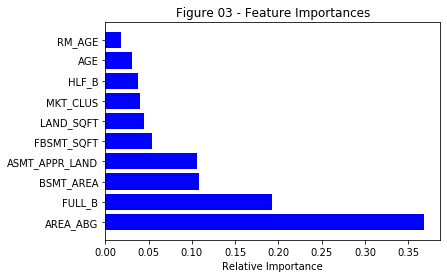
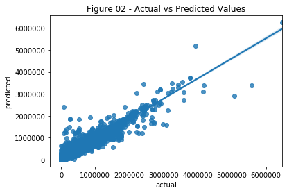
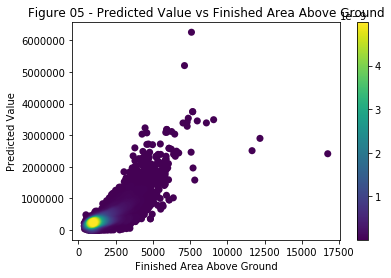
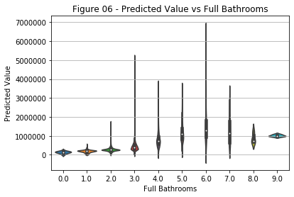
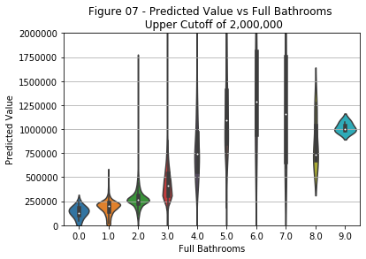
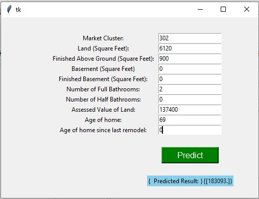
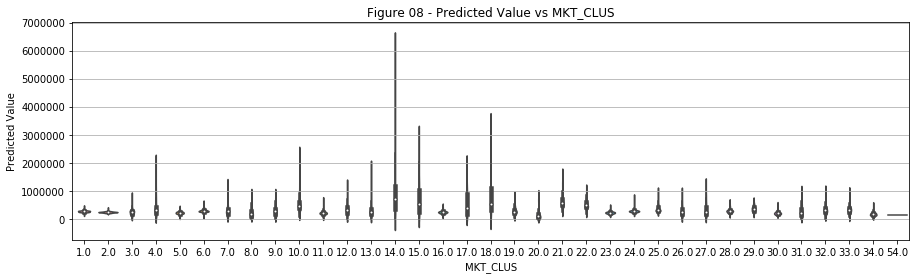

# Denver Real Estate Estimator

* How to spend or invest your money in real estate is a difficult decision. In addition to what is currently  available on the market, it is helpful to work with historical data as well.  *

## 1. Data

Data was sourced from the city of Denver's Open Data Catalog (https://www.denvergov.org/opendata/dataset/city-and-county-of-denver-real-property-sales-and-transfers)

There were two files that had to be loaded, a Sales file that recorded individual sales since 2008 and a Characteristics file that gives details for each property.

## 2. Data Cleaning 

[Step 2 - Data Wrangling Notebook] (https://github.com/NancyKecso/Springboard/blob/master/Capstone%202%20Denver%20Real%20Estate/Capstone%202%20-%20Step%202%20Data%20Wrangling.ipynb)

The data came in very clean with minimal missing fields.  Some Sales records that did not find matches in the Characteristics file were dropped.

## 3. EDA

[Step 3 - Exploratory Data Analysis] (https://github.com/NancyKecso/Springboard/blob/master/Capstone%202%20Denver%20Real%20Estate/Capstone%202%20-%20Step%203%20Exploratory%20Data%20Analysis.ipynb)

Two major problems were revealed during EDA:
1) fields that had been duplicated when the Sales and Characteristics files were combined
2) the linear relationship between Total Values and Assessed Values

Reviewing the input data revealed whole categories which would not be of interest for modeling such as owner and address information.

## 4. Modeling

[Step 4 - Preprocessing] (https://github.com/NancyKecso/Springboard/blob/master/Capstone%202%20Denver%20Real%20Estate/Capstone%202%20-%20Step%204%20Preprocessing.ipynb)

I ran the training data through four different models:  Linear Regression, Random Forest, k nearest neighbors, and SVR.

The Random Forest was clearly the optimal choice.  

I had originally converted the neighborhood category to a set of dummy columns but that took most of the models too long to process. Dropping these fields from the model input had little effect on the model scores, so the extra fields were eliminated.
I also ran Boruta against the proposed features and only used features in the green or blue regions.

## 5. Predictions

[Step 5 - Modeling] (https://github.com/NancyKecso/Springboard/blob/master/Capstone%202%20Denver%20Real%20Estate/Capstone%202%20-%20Step%205%20Modeling.ipynb)

The two most important features were the Finished Square Feet Above Ground and the number of full bathrooms. Here are their distributions relative to predicted values:

 | 

The final notebook contains an interactive cell which allows a user to input the values of interest and obtain a prediction of the improved value of the property.

## 6. Future Improvements

* The MKT_CLUS was not identified in the metadata from Denver and yet was one of the features that was identified as important.  Some additional understanding of what it is would be helpful.

* The information included in these models was from completed sales. It does not include information about property that was put up for sale but never sold or information about how long the sale took.
